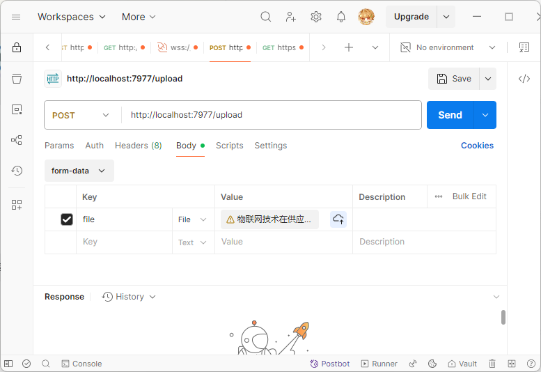

# reduce-AIGC
一个为了降低论文的AIGC率的仓库

> 该项目的开发目的:为了减轻应届本科目前论文写作花费的时间,原本的本科生在大四期间参加的社会实践已经要耗费大多精力了,加上搞毕设,还得专门一篇无任何实际价值的论文?我觉得不能再这样了,除非是真的为全人类有价值贡献的研究的论文,那我反对你使用AI工具.否则,本科生就是想获得一个学位证,然后可以放心的去找工作,或去实现那些自己的梦想.
>
> 这个项目完全开源,任何人都可以无偿使用,也欢迎提出修改意见和改进pr
> 最后,祝愿每一个即将毕业的应届生,前程似锦未来可期

## 预计开发的功能todo

- [x] 读取docx信息,通过大语言模型的能力,实现降低AIGC
- [ ] 语义分析,可能后续会通过分析人类的论文,去尝试在语义切割上,对每一块去优化
- [ ] 提示词优化:目前的提示词我感觉还可以再提升
- [ ] 应该给一个可以调整大语言模型的方法
- [ ] ...

## 使用方式:

> 目前支援前后端服务
>
> ### 后端使用流程
>
> > 需要先运行下面的bash
>
> ```bash
> npm i
> npm i -g pm2 / mac:sudo npm install -g pm2
> npm run dev
> ```
>
> > 配置环境变量文件`.env`
>
> ```env
> SERVER_PORT=7977
> BASE_URL=http://localhost:7977
> DEEPSEEK_API_KEY=sk-
> DEEPSEEK_API_BASE_URL=https://api.deepseek.com/v1
> 
> ```
>
> > 后面可以使用`postman`文件提交一个docx就行
>
> 
>
> ### 前端使用
>
> 在`front`的`dist`目录下我已经打包好一个简单网页,只要启动好后端,把文件提交上去,就OK了
> 如果有修改的想法,也可以
>
> 需要配置环境变量


> **请注意:你需要自己觉得自己研究的论文是否对全人类有价值再使用**

